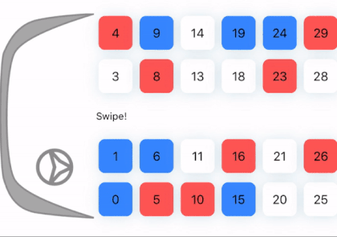

# ALBusSeatView 💺

[](https://cocoapods.org/pods/ALBusSeatView) [](https://cocoapods.org/pods/ALBusSeatView) [](https://cocoapods.org/pods/ALBusSeatView) 


## Example

To run the example project, clone the repo, and run `pod install` from the Example directory first.




## Screenshots
|           Start            |           Select           |      Gender Selection      |           Voilà!           |
| :------------------------: | :------------------------: | :------------------------: | :------------------------: |
|  |  |  |  |


## Installation

ALBusSeatView is available through [CocoaPods](https://cocoapods.org). To install
it, simply add the following line to your Podfile:

```ruby
pod 'ALBusSeatView'
```

## Usage

```swift

// If you want to config more
// let config = ALBusSeatViewConfig()
// ALBusSeatView(withConfig: config)

let seatView = ALBusSeatView()
seatView.delegate = self
seatView.dataSource = self

view.addSubview(seatView)

//ALBusSeatViewDataSource

func seatView(_ seatView: ALBusSeatView, numberOfSeatInSection section: Int) -> Int {
     return 43 // Total seat count
}

func seatView(_ seatView: ALBusSeatView, seatNumberForIndex indexPath: IndexPath) -> String {
    return "10" // Seat Number
}

func seatView(_ seatView: ALBusSeatView,
              seatTypeForIndex indexPath: IndexPath) -> ALBusSeatType {
        
    return .empty
}


// Seat Types

public enum ALBusSeatType: Int {
    /// Free to pick
    case empty
    /// Already sold by woman or man
    case sold
    /// Being selected
    case selected
    /// Already sold by woman
    case soldWoman
    /// Already sold by man
    case soldMan
    /// Not a seat. Can not be able to select
    case none
}

```


## Documentation

* [API Reference](https://applogistdev.github.io/ALBusSeatView/) 


## Config (ALBusSeatViewConfig)  

#### Layout

| Param                 | Desc | Default | Type |
| --------------------- | ---- | ------- | ------ |
| leftHandDrivePosition | Left drive position status | True | Bool |
| marginBetweenSeats | Margin between seats | 5.0 | CGFloat |

#### Seat

| Param                   | Desc | Default | Type |
| ----------------------- | ---- | ------- | -------- |
| seatEmptyBGColor        | Empty seat color | .white | UIColor |
| seatSoldBGColor        | Seat color purchased by woman or man. (Common seat) | .gray | UIColor |
| seatSelectedBGColor     | Selected seat color | .green | UIColor |
| seatSoldWomanBGColor    | Seat color purchased by woman | .red | UIColor |
| seatSoldManBGColor      | Seat color purchased by man | .blue | UIColor |
| seatCornerRadius        | Seat corner radius | 8.0 | CGFloat |
| seatBorderColor         | Seat border color | .clear | UIColor |
| seatBorderWidth         | Seat border width | 0 | CGFloat |
| seatShadowColor         | Seat shadow color | .lightGray | UIColor |
| seatShadowRadius        | Seat shadow radius | 5.0 | CGFloat |
| seatShadowSize          | Seat shadow size | 1,1 | CGSize |
| seatShadowOpacity       | Seat shadow opacity | 0.7 | Float |
| seatRemoveImage         | The remove button image for selected seat | nil | UIImage? |
| seatNumberFont          | Seat number label font | .system(15) | UIFont |
| seatNumberSelectedFont  | Selected seat number label font | .systemBold(15) | UIFont |
| seatNumberColor         | Seat number label color | .black | UIColor |
| seatNumberSelectedColor | Selected seat number label color | .white | UIColor |

#### Hall

| Param                 | Desc | Default | Type |
| --------------------- | ---- | ------- | ------ |
| centerHallHeight | Bus hall height | 20 | CGFloat |
| centerHallInfoText | Hall information label text | "" | String |
| centerHallInfoTextColor | Hall information label text color | .black | UIColor |
| centerHallInfoTextFont | Hall information label text font | .system(12) | UIFont |

#### Bus Front Section

| Param                 | Desc | Default | Type |
| --------------------- | ---- | ------- | ------ |
| busFrontImage | Bus front image | nil | UIImage? |
| busFrontImageWidth | Bus front image width | 50 | CGFloat |

#### Bus Floor Section

| Param                 | Desc | Default | Type |
| --------------------- | ---- | ------- | ------ |
| floorSeperatorWidth | Floor section  width | 50 | CGFloat |
| floorSeperatorImage | Floor section image | nil | UIImage? |

#### Gender Tooltip

| Param                 | Desc | Default | Type |
| --------------------- | ---- | ------- | ------ |
| tooltipText | Gender selection tooltip title | "Select Gender" | String |

## Author

sonifex, sonerguler93@gmail.com

## License

ALBusSeatView is available under the MIT license. See the LICENSE file for more info.
