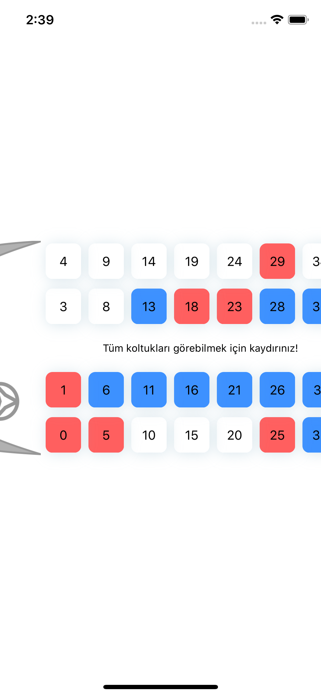
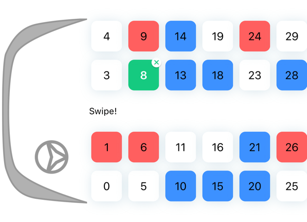
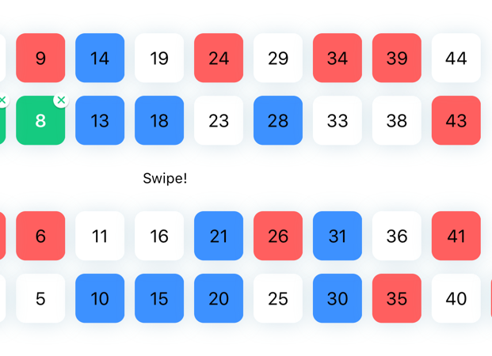

# ALBusSeatView 💺

[](https://cocoapods.org/pods/ALBusSeatView)[](https://cocoapods.org/pods/ALBusSeatView)[](https://cocoapods.org/pods/ALBusSeatView)

## Example

To run the example project, clone the repo, and run `pod install` from the Example directory first.

## Screenshots
|           Start            |           Select           |      Gender Selection      |           Voilà!           |
| :------------------------: | :------------------------: | :------------------------: | :------------------------: |
|  |  |  |  |


## Installation

ALBusSeatView is available through [CocoaPods](https://cocoapods.org). To install
it, simply add the following line to your Podfile:

```ruby
pod 'ALBusSeatView'
```

## Usage

```swift

// If you want to config more
// let config = ALBusSeatViewConfig()
// ALBusSeatView(withConfig: config)

let seatView = ALBusSeatView()
seatView.delegate = self
seatView.dataSource = self

view.addSubview(seatView)

```

## Author

sonifex, sonerguler93@gmail.com

## License

ALBusSeatView is available under the MIT license. See the LICENSE file for more info.
